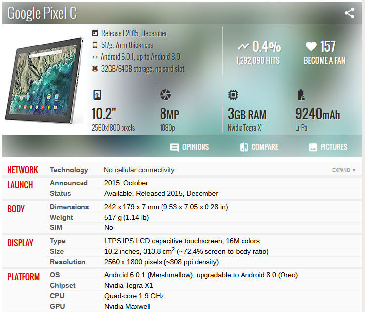
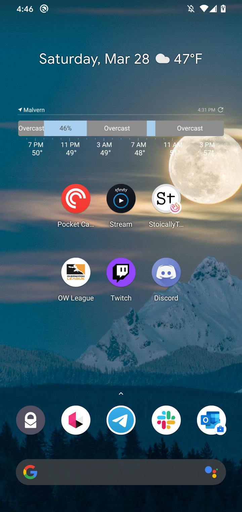
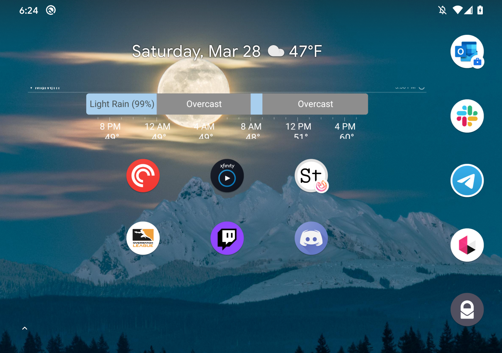
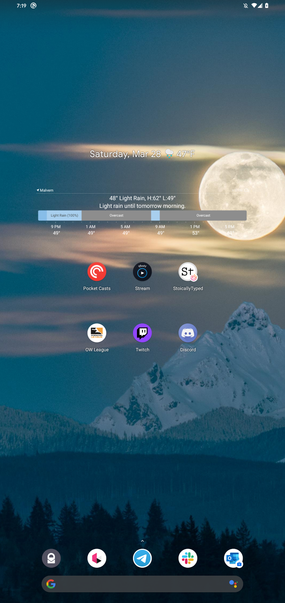
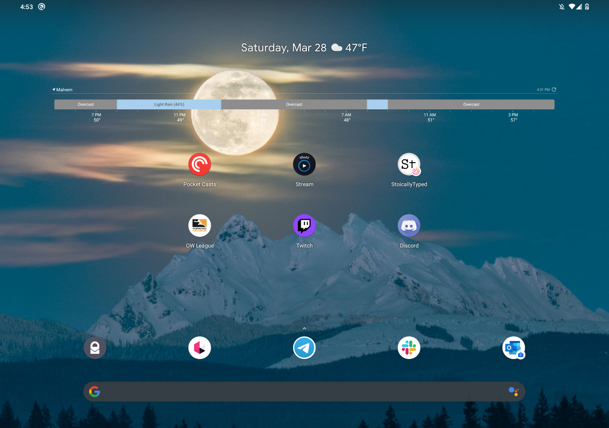
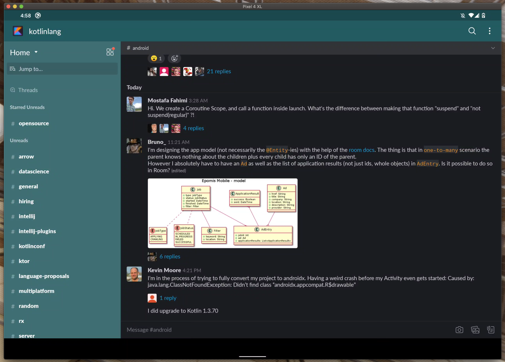

### [The Pledge](https://youtu.be/LV-cXixgrho)
So you forgot your tablet at the office and now you are working from home for the foreseeable future. It's still important to test those tablet views! Here’s a quick and painless way to turn an ordinary phone into a tablet and back again. This isn't one of those one way disappearing acts!

#### Tools of the Trick
1. [Android Debug Bridge](https://developer.android.com/studio/command-line/adb) - Our good friend the Android Debug Bridge (adb). We will be using some commands here to perform our magic trick.
2. Search Engine - One of your choice, I recommend [DuckDuckGo](https://duckduckgo.com/) [(go privacy!)](https://duckduckgo.com/privacy)
3. Phone - Can be any phone you want to use. I promise we will put it back to the way it was by the end of this article
4. [scrcpy](https://github.com/Genymobile/scrcpy) - An application to view and control your Android device from your computer

### [The Turn](https://youtu.be/LV-cXixgrho)
The first step you want to take is to find the resolution and pixel density of the tablet you want to emulate on your device. For example, if we want to emulate a [Pixel C device](https://www.gsmarena.com/google_pixel_c-7826.php) we can search up its specs on a site like GSMArena. We find that this device has a **2560x1800** resolution display with a pixel density of **308** ppi (pixels per inch).

<div className="Image__Medium">
  
</div>

For the next step I'm going to assume that `adb` is installed and set up on your system. If it is not, check out this write up from [xda developers](https://www.xda-developers.com/install-adb-windows-macos-linux/).

The Android Debug Bridge has a slew of great commands. The one we will be using today is the `shell` command with the `wm` command.

`shell` - allows us to access the linux shell on an Android device

`wm` - accesses the devices window manager

We also need to know two parameters for the `wm` command.

`size` - which will allow us to see our current and original screen resolution, as well as set a desired screen resolution

`density` - which allows us to see our current and original pixel densities as well as set a desired pixel density.
Lets try this out in our terminal.

Now let's try this command! Make sure you have your device connected and USB Debugging enabled! I am running this on a Google Pixel 4XL. Here's what is shown when running these commands

```bash
> adb shell wm size
Physical size: 1440x3040

> adb shell wm density
Physical density: 560
``` 
As you can see we are given the original resolution with `size` and the original pixel density with `density`. 

<div className="Image__Small">
  
</div>

Time to become a tablet! Remember this is easily reversible if something goes awry.
Let's grab the resolution of a Pixel C tablet and set our phone resolution to it using the command:

```bash
> adb shell wm size 2560x1800
```

You should see your device make this change immediately.

<div className="Image__Small">
  
</div>

Running the `size` command again will show that we now have another line of output for the **Override size**.

```bash
> adb shell wm size
Physical size: 1440x3040
Override size: 2560x1800
```

Now the screen will look a little funny but this is because the pixel density of the device most likely isn't calibrated correctly for this resolution.  Lets see what it looks like when we change **only** the density.

```bash
> adb shell wm density 308
```

<div className="Image__Small">
  
</div>


And again our change can be verified by running the `density` command once more.
```bash
> adb shell wm density
Physical density: 560
Override density: 308
```

Now it's time to bring it all together changing both size and density to match what the Pixel C specs have!

```bash
> adb shell wm size 2560x1800
> adb shell wm density 308
``` 

> *Alakazam!* 

<div className="Image__Small">
  
</div>

A tablet! This is similar to changing the resolution or scaling on your laptop or monitor! Now when you run your app the tablet specific views will be rendered!

Hmm, it still looks funny on the device though. It's probably pretty small. It might not even respond to touch inputs. That's okay! This is expected. There are a few ways we can address this. Firstly, a Pixel C is a tablet device with a very high resolution screen and pixel density. Choosing a resolution and pixel density from a tablet that isn't quite as large as the Pixel C's will provide a bit of a better experience. However, there is a *cooler* option.

#### Introducing [`scrcpy`](https://github.com/Genymobile/scrcpy)
If you have never used `scrcpy` before you will love it. It's a [magic trick all in its own](https://blog.rom1v.com/2018/03/introducing-scrcpy/) by some developers at [Genymobile](https://github.com/Genymobile) to control and view your Android devices from your computer. It can easily be installed for all platforms following the instructions on their [Github README](https://github.com/Genymobile/scrcpy/blob/master/README.md).
Now that it's installed all we need to do is open up a terminal and run:

```bash
> scrcpy
```
If you only have one device connected you will be able to see it right away! If you have more than one you will need to get your device's serial number and then use that to invoke `scrcpy`.

```bash
> adb devices
List of devices attached
0123456789abcdef	device

> scrcpy -s 0123456789abcdef
```

<div className="Image__Medium">
  
</div>


The reason we are using `scrcpy` here is the window is resizable so you can now enjoy that full size "tablet experience" being rendered on your phone and use your mouse and keyboard for inputs!
And voila! We now have a solution for seamless tablet development. 

### [The Prestige](https://youtu.be/LV-cXixgrho)
When done working on tablet views it is very easy to undo our tablet transformation trick! All that is needed is a simple reset with:

```bash
> adb shell wm size reset
> adb shell wm density reset
```

**Boom!** Back in the phone business.
But wait! We can go even further. We can look up the screen settings of some smaller phones to see how our views look on smaller screens. I'll leave this to you to try on your own!
I hope this has helped you if you need to check things out on a tablet but happen to find yourself without one!

Lastly, please remember to stay home if you can and wash your hands. I wish for you to be happy and healthy in this time of viruses and social distancing. If you have any questions about this article or just need some human interaction please reach out on Twitter on [@StoicallyTyped](https://twitter.com/StoicallyTyped) or [@matthewcmckenna](https://twitter.com/matthewcmckenna)!


---
*Thanks to <a style="background-color:black;color:white;text-decoration:none;padding:4px 6px;font-family:-apple-system, BlinkMacSystemFont, &quot;San Francisco&quot;, &quot;Helvetica Neue&quot;, Helvetica, Ubuntu, Roboto, Noto, &quot;Segoe UI&quot;, Arial, sans-serif;font-size:12px;font-weight:bold;line-height:1.2;display:inline-block;border-radius:3px" href="https://unsplash.com/@frostroomhead?utm_medium=referral&amp;utm_campaign=photographer-credit&amp;utm_content=creditBadge" target="_blank" rel="noopener noreferrer" title="Download free do whatever you want high-resolution photos from Rodion Kutsaev"><span style="display:inline-block;padding:2px 3px"><svg xmlns="http://www.w3.org/2000/svg" style="height:12px;width:auto;position:relative;vertical-align:middle;top:-2px;fill:white" viewBox="0 0 32 32"><title>unsplash-logo</title><path d="M10 9V0h12v9H10zm12 5h10v18H0V14h10v9h12v-9z"></path></svg></span><span style="display:inline-block;padding:2px 3px">Rodion Kutsaev</span></a> for the hero image!*