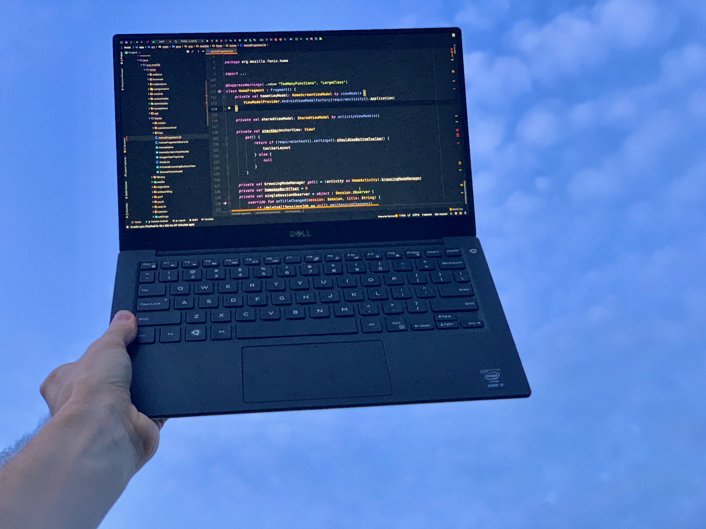
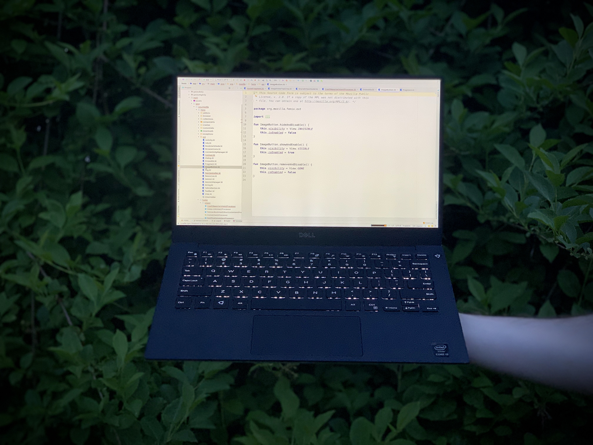
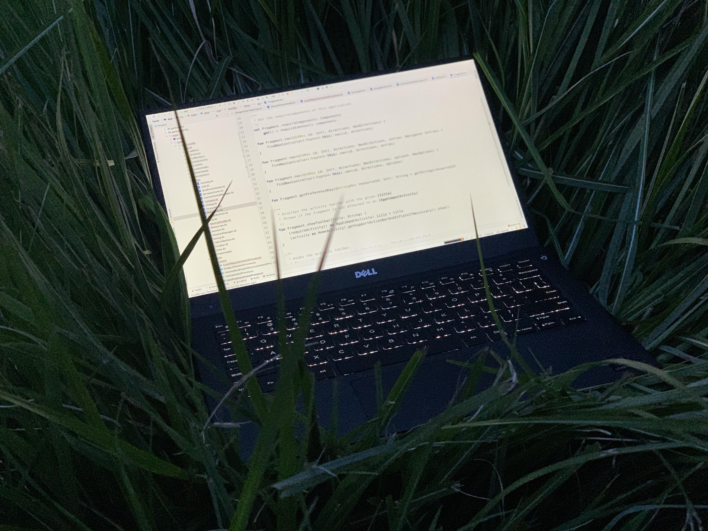
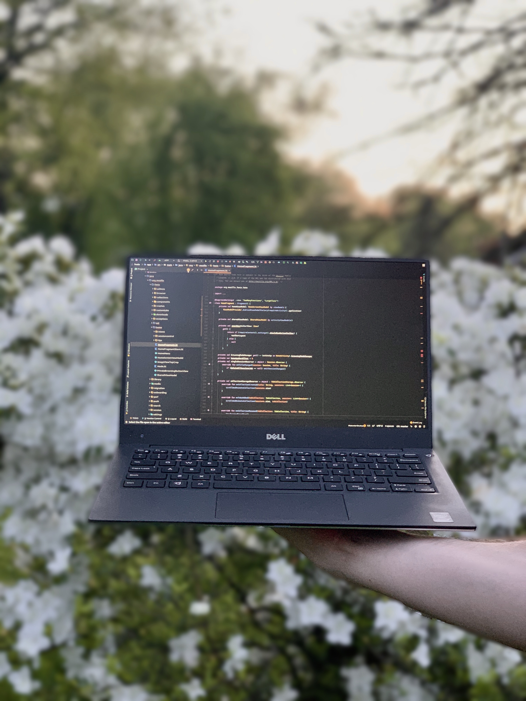
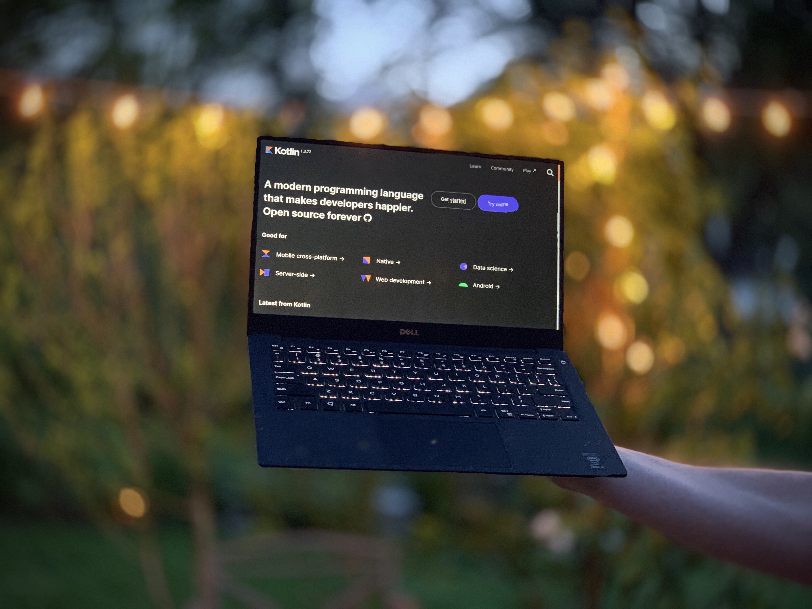

When creating content it is great to be able to search and find photos that are free to use to help add some. 
[Unsplash](https://unsplash.com) is a fantastic resource for finding these resources because of their license to use the content freely.
Searching `"code"` on Unsplash yeilds a bunch of great pictures of development and code, but nothing for Kotlin or Android. 
Even searching for `"kotlin"` or `"android"` directly doesn't provide the greatest results (actually nothing at all for kotlin until recently).
This comes purely because of a lack of content around Kotlin and Android on the platform. [@mreichelt](https://www.twitter.com/mreichelt "@mreichelt on Twitter") had the fantastic
idea to hold a [#KotlinPhotoContest](https://dev.to/mreichelt/the-kotlin-loyalty-free-photo-contest-4ec0 "#KotlinPhotoContest on Idea on Dev.to") to help generate free to use
content on Unsplash for kotlin developers to use. 

  <Tweet tweetId="1256172731785248768" />

Check out the submissions on [Twitter](https://twitter.com/hashtag/KotlinPhotoContest "#KotlinPhotoContest on Twitter") or in Marc's follow up post on [Dev.to](https://dev.to/mreichelt/kotlin-photo-contest-thank-you-for-your-submissions-of3)

## My Submissions

I created and submitted a few pictures to Unsplash for the contest and unfortunately not all of them passed 
Unsplash's quality metrics and have been removed. 
Therefore I am making them available here, also **free to use**. 

Check them out below!

  

  

  

  

  

  

---

This is the only image that currently remains on Unsplash. You can check it out and download it in various qualities [here](https://unsplash.com/photos/LfjR6IOL7ts).

  

---

I can see how some of these were not up to the standard that Unsplash expects. I will be trying again to get them approved and on the platform for others to use.

Going forward, I am going to be more conscious of opportunities to take kotlin and AndroidDev related photos to submit to unsplash. Creating this content to be used by others will be 
helpful for all of the presenters and writers in the kotlin community! If you do the same let me know on [Twitter](https://twitter.com/himattm)! I'd love to see! 🎉