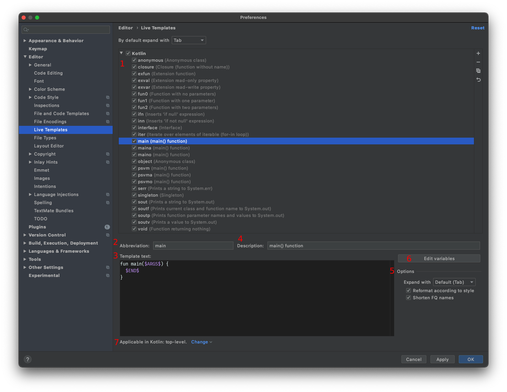

### Intro to Live Templates

If you are like me you like to optimize some of the most common situations in your day to day tasks. Finding little ways to make your machine work more for you is satisfying and when it all adds up can lead to some serious time saved! 

Android Studio's live templates are a great and fun way to increase your productivity.

One way to think about live templates are like acronyms. Much like in english "IDK" expands to "I don't know" a live template can expand from `main` to:

```java
fun main(args: Array<String>) {
  $END$
}
```

###### In the follow parts of this post you'll learn:
- To use Live Templates in Android Studio
- How to create your own Live Templates
- About the many variables available for Live Templates
- How to use Live Templates with Jetpack Compose

Let's dive in!

### How to use Live Templates

Android Studio comes with a bunch of live templates out of the box. These can be accessed by going to: `Preferences > Editor > Live Templates`. Lets see what kind of options we have in this settings screen.

<div className="Image__Medium">
  
</div>

1. The list of available categories and live template .
2. Abbreviation: what is typed to trigger the live template.
3. Template Text: Where the live template is constructed.
4. Description: A description for what this live template does.
5. Additional options for this live template.
6. The "Edit variables" button for this live template.
7. A context selector to choose where a live template can be invoked.

To use one of these live templates lets make a new kotlin file, type `main`, and then wait a second. A tool-tip window will show up enabling the insertion of a live template! Press `enter` or `tab` to insert.

<div className="Image__Medium">
  
</div>

And that's it! You have now used a Live Template. 

Explore some of the example live templates for Kotlin and Android in the settings window to see what else is predefined. In the next section we will learn how to customize one of the preexisting templates to be a bit more useful.

### Creating a Custom Live Template

Let's start by creating a simple live template for a custom `TODO` comment. I usually put my initials in my `TODO`'s so that I can easily search them. They look like this:

```
// TODO:mcm
```

To start making this live template follow these steps:

1. Go to `Preferences > Editor > Live Templates`
2. Select the Kotlin group. This is the group the live template will be added to. 
2. Click the `+` button in the upper right corner.
3. Select Live Template.
4. Type the abbreviation to use to trigger the live template.
5. Give the live template a description.
6. In the code block, add the code for the live template. In our case it will be the above `TODO`.
7. Choose the contexts where this template should be usable.
   1. For this template we want to use it in Kotlin.
   2. And it should be usable in all contexts **except** comments (since we already add the comment slashes).

<div className="Image__Medium">
  
</div>

And that's it! Here it is in action!

<div className="Image__Small">
  
</div>

### Live Template Variables

## Defining Variables

To define a variable in a live template simply surround a string with dollar signs. Let's look at the provided Kotlin `interface` live template:

```java
interface $NAME$ {
  $END$
}
```

###### There are two variables here:
1. `$NAME$`
2. `$END$`

After invoking the live template with `tab` the editor places your cursor to define a name for the interface. After entering a value for `$NAME$` pressing `tab` again will take you to the next variable, until you get to the variable `$END$`. `$END$`, and a few other variables, are predefined for specific use.

### Predefined Variables
- `$DOLLAR$`
- `$END$`
- `$SELECTION$`


The `$DOLLAR$` variable is used for inserting a dollar sign (`$`) into a live template. Think of it like an escape sequence in a `String`. It will most likely be used in those sorts of situations. To see an example look at the Kotlin live template, `soutv` (Prints a value to System.out).

```java
println("$EXPR_COPY$ = $DOLLAR${$EXPR$}")
```


`$END$` is a special live template variable that just signifies the template is done being populated. When pressing `tab` leads to this variable your cursor will be placed in the `$END$`'s position and the live template will no longer be active.


`$SELECTION$` is a special variable type as it represents text that is highlighted in the editor. For instance to surround a piece of code with parenthesis we could define a live template like this:

```java
($SELECTION$)
```

This live template is already defined as `P` under the `Live Templates > surround` section, along with a few others.

To trigger a selection live template, select the text you wish to use and then, if you are on mac, press `⌥+⌘+J` (`Ctrl+Alt+J` for windows/linux) to prompt the dialog. Then the applicable live templates will appear! Now you can type the name or select which one to use.

<div className="Image__Small">
  
</div>

### Variable Functions

Alright, this is where we get to the true magic of live templates.

In the first section we called out the edit variable button in the live template window. This is where variables gain extra power.

Lets jump to `Live Templates > Kotlin > iter` and see how it is defined:

```java
for ($VAR$ in $ITERABLE$) {
  $END$
}
```

To break this down, we have the structure for a Kotlin for loop. Two variables are defined, `$VAR$` for the variable name  and `$ITERABLE$` for the iterable collection. And finally `$END$` to place the cursor in the for loop when the live template finishes executing.

Up until now this is exactly how we would define such a structure, but lets super charge it.

Click on the "Edit Variables" button that we saw above in location 6 to bring up this window table containing each of the defined variables.

<div className="Image__Medium">
  
</div>

The Expression column has a drop down menu that provides access to many functions that can make the live template variables smarter. Let's take a look at the two variables in this tempate.

For the variable `ITERABLE` we see that there is an expression of `kotlinVariable()`. This function will make a suggestion for something that can populate this variable. If nothing is found then a Default value can be provided as a suggestion.

For `VAR` we see it has `kotlinSuggestVariableName()`. This function is tells the live template to put something like `i`, `s`, etc if a type can be inferred or loops are being nested. Here the Default value to suggest is `i`.

The last column in this table is "Skip if defined". Checking this box means that if the function executes and returns a value then this variable is considered defined and the live template will automatically move your the cursor to the next variable.

Lets see these functions in action! I will make a function to print out elements of a `List<String>`. Since Android Studio knows the list is only of type string it will suggest a variable name of `s` for `VAR`. And since we have a variable of type Iterable in our scope the variable `ITERABLE` will populate with the available `val list`! Finally, since the check boxes for "Skip if defined" are not enabled, the cursor still goes to each of these variable in case they need to be edited.


<div className="Image__Small">
  
</div>

There are LOTS of these functions available for live template variables. The function names are pretty descriptive and I recommend looking through the drop down menus to see the options. There is a comprehensive list on the [Jetbrains website](https://www.jetbrains.com/help/idea/template-variables.html#predefined_functions).

### Live Template Pro tips

## Options

There are a few options in the bottom right of the live template window which can add additional convenience.

- Expand with `tab`
  - Allows for choosing which key will expand a live template	
- Reformat according to code style
  - a checkbox to use the project's code style when inserting a live template
- Shorten FQ names
  - FQ stands for Fully Qualified
  - This is a way to automatically import objects or annotations that a live template uses

### Automatic Imports with Live Templates

To automatically import with a live template the "Shorten FQ names" checkbox needs to be checked. Then include the fully qualified name in the live template definition.

Here is an example for making a quick test function and not needing to import the `@Test` annotation:

```java
@org.junit.Test
fun $TEST_FUNCTION$() {
  $END$
}
```

### Applicable Contexts

Not all live templates should be accesible at all times. For instance, Kotlin live templates shouldn't be available in a Java context, but we can have even more control than that! Let's look at the live template to create a function with no return type (`void`). 

<div className="Image__Small">
  
</div>

This live template is useful at the levels of:

- top-level
- statement
- class

but not at the other levels of:

- comment
- expression
- object declaration
- other

This means is we can granularly configure when a live template could be applicable. Typing `void` while in a class will for the live template, but typing `void` in a comment will not!

###### In a class:
<div className="Image__Medium">
  
</div>


###### In a comment:
<div className="Image__Medium">
  
</div>


### Live Templates for Jetpack Compose

Many of the code structures, syntax, and best practices in Jetpack Compose UI are very repeatable which means this is a great opportunity to create live templates! Android Studio Arctic Fox comes with some Compose live templates, but lets add some common uses that aren't included.

##### Private Composable

<table>
  <tr>
    <th><b>Abbreviation</b></th>
    <td>pcomp</td>
  </tr>
  <tr>
    <th><b>Description</b></th>
    <td>Create a private composable function</td>
  </tr>
  <tr>
    <th><b>Shorten FQ Names</b></th>
    <td>✅</td>
  </tr>
</table>

```java
@androidx.compose.runtime.Composable
private fun $NAME$() {
  $END$
}
```

##### Remember mutableStateOf delegate

<table>
  <tr>
    <th><b>Abbreviation</b></th>
    <td>remstate</td>
  </tr>
  <tr>
    <th><b>Description</b></th>
    <td>Create a remember mutableStateOf Delegate</td>
  </tr>
  <tr>
    <th><b>Shorten FQ Names</b></th>
    <td>✅</td>
  </tr>
</table>

```java
val $VAR$ by androidx.compose.runtime.remember { 
  androidx.compose.runtime.mutableStateOf($END$)
}
```

##### Make a Spacer

<table>
  <tr>
    <th><b>Abbreviation</b></th>
    <td>spacer</td>
  </tr>
  <tr>
    <th><b>Description</b></th>
    <td>Makes a spacer of set width</td>
  </tr>
  <tr>
    <th><b>Shorten FQ Names</b></th>
    <td>✅</td>
  </tr>
</table>

```java
androidx.compose.foundation.layout.Spacer(Modifier.width($NUM$.dp))
$END$
```

##### LazyColumn

<table>
  <tr>
    <th><b>Abbreviation</b></th>
    <td>lazycol</td>
  </tr>
  <tr>
    <th><b>Description</b></th>
    <td>Makes a LazyColumn Composable</td>
  </tr>
  <tr>
    <th><b>Shorten FQ Names</b></th>
    <td>✅</td>
  </tr>
</table>

###### Edit Variables Values

<table>
  <tr>
    <th><b>Name</b></th>
    <td>MOD</td>
  </tr>
  <tr>
    <th><b>Expression</b></th>
    <td>variableOfType(androidx.compose.ui.Modifier)</td>
  </tr>
  <tr>
    <th><b>Default</b></th>
    <td>"androidx.compose.ui.Modifier"</td>
  </tr>
  <tr>
    <th><b>Skip if defined</b></th>
    <td>Unchecked</td>
  </tr>
  <tr>
    <th> </th>
    <td> </td>
  </tr>
  <tr>
    <th><b>Name</b></th>
    <td>LIST</td>
  </tr>
  <tr>
    <th><b>Expression</b></th>
    <td>kotlinVariable()</td>
  </tr>
  <tr>
    <th><b>Default</b></th>
    <td> </td>
  </tr>
  <tr>
    <th><b>Skip if defined</b></th>
    <td>Unchecked</td>
  </tr>
</table>

```java
androidx.compose.foundation.lazy.LazyColumn(modifier = $MODIFIER$) {
  items(items = $LIST$) { item ->
    $END$          
  }
)
```

##### Day / Night Preview Composable

_This live template idea is from [Adam McNeilly](https://twitter.com/AdamMc331)_

<table>
  <tr>
    <th><b>Abbreviation</b></th>
    <td>dnprev</td>
  </tr>
  <tr>
    <th><b>Description</b></th>
    <td>Create a day/night @Preview composable function</td>
  </tr>
  <tr>
    <th><b>Shorten FQ Names</b></th>
    <td>✅</td>
  </tr>
</table>

```java
@androidx.compose.ui.tooling.preview.Preview(
    name = "Night Mode",
    uiMode = android.content.res.Configuration.UI_MODE_NIGHT_YES,
)
@androidx.compose.ui.tooling.preview.Preview(
    name = "Day Mode",
    uiMode = android.content.res.Configuration.UI_MODE_NIGHT_NO,
)
@androidx.compose.runtime.Composable
private fun $NAME$Preview() {
    $NAME$($END$)
}
```

##### Phone Preview Annotation

_This series of `@Preview` annotation live templates is inspired by [William Barbosa](https://twitter.com/heytherewills/status/1387746132147806214/photo/1)_

<table>
  <tr>
    <th><b>Abbreviation</b></th>
    <td>prevphone</td>
  </tr>
  <tr>
    <th><b>Description</b></th>
    <td>Create an @Preview annotation for a phone in light/dark mode</td>
  </tr>
  <tr>
    <th><b>Shorten FQ Names</b></th>
    <td>✅</td>
  </tr>
</table>

```java
@androidx.compose.ui.tooling.preview.Preview(
    name = "Phone Night Mode",
    uiMode = android.content.res.Configuration.UI_MODE_NIGHT_YES,
)
@androidx.compose.ui.tooling.preview.Preview(
    name = "Phone Day Mode",
    uiMode = android.content.res.Configuration.UI_MODE_NIGHT_NO,
)
```

##### Tablet Preview Annotation

_This series of `@Preview` annotation live templates is inspired by [William Barbosa](https://twitter.com/heytherewills/status/1387746132147806214/photo/1)_

<table>
  <tr>
    <th><b>Abbreviation</b></th>
    <td>prevtablet</td>
  </tr>
  <tr>
    <th><b>Description</b></th>
    <td>Create an @Preview annotation for a tablet in light/dark mode</td>
  </tr>
  <tr>
    <th><b>Shorten FQ Names</b></th>
    <td>✅</td>
  </tr>
</table>

```java
@androidx.compose.ui.tooling.preview.Preview(
    name = "Tablet Night Mode",
    uiMode = android.content.res.Configuration.UI_MODE_NIGHT_YES,
    heightDp = 1080,
    widthDp = 760,
)
@androidx.compose.ui.tooling.preview.Preview(
    name = "Tablet Day Mode",
    uiMode = android.content.res.Configuration.UI_MODE_NIGHT_NO,
    heightDp = 1080,
    widthDp = 760,
)
```

##### Desktop Preview Annotation

_This series of `@Preview` annotation live templates is inspired by [William Barbosa](https://twitter.com/heytherewills/status/1387746132147806214/photo/1)_

<table>
  <tr>
    <th><b>Abbreviation</b></th>
    <td>prevdesktop</td>
  </tr>
  <tr>
    <th><b>Description</b></th>
    <td>Create an @Preview annotation for a desktop in light/dark mode</td>
  </tr>
  <tr>
    <th><b>Shorten FQ Names</b></th>
    <td>✅</td>
  </tr>
</table>

```java
@androidx.compose.ui.tooling.preview.Preview(
    name = "Desktop Night Mode",
    uiMode = android.content.res.Configuration.UI_MODE_NIGHT_YES,
    heightDp = 760,
    widthDp = 1080,
)
@androidx.compose.ui.tooling.preview.Preview(
    name = "Desktop Day Mode",
    uiMode = android.content.res.Configuration.UI_MODE_NIGHT_NO,
    heightDp = 760,
    widthDp = 1080,
)
```

---

### What's next?

Go play with and create some live templates! They are really fun to make and use in day to day development. If you need help with them or want to share what you've made reach out on [Twitter](https://twitter.com/intent/tweet?text=.@himattm)! I'd love to see them (and add to my collection 😉)!

---

Header Photo by <a href="https://unsplash.com/@tim_arterbury?utm_source=unsplash&utm_medium=referral&utm_content=creditCopyText">Tim Arterbury</a> on <a href="https://unsplash.com/s/photos/template?utm_source=unsplash&utm_medium=referral&utm_content=creditCopyText">Unsplash</a> and modified by me.

_Special thanks to [Adam McNeilly](https://twitter.com/AdamMc331) for reviewing and proof reading this article._